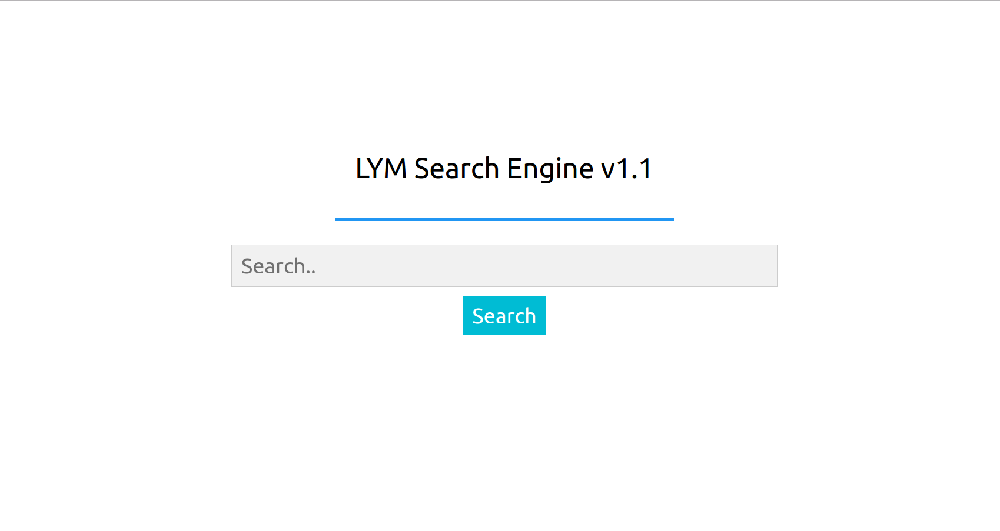
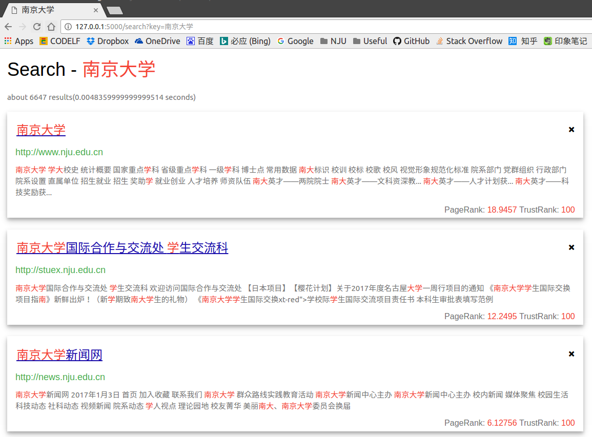

# 
 **LYM Search Engine V1.1** 

## 软件概述
LYM Search Engine v1.1 是一个校内搜索引擎原型，功能包括爬虫，建立倒排索引，网页查询等。Web服务器采用 [Flask][flask] 框架，除了爬虫和一些脚本工作用 **Python** 完成，核心功能均为 **C++** 实现。麻雀虽小，五脏俱全。

## 功能实现
### 一、网页爬虫 (Crawler/Spider)
#### 概述
爬虫程序使用 **Python** 语言，相关文件在 src/crawl/ 下，可以通过 **make crawl** 命令启动。爬虫程序采用多线程模型，用广度优先遍历的方法，用任务队列来存储待爬网页，设定只会爬取南京大学站内网页。
1. 程序首先从队列中获取一个 url 地址，然后通过 [requests][requests] 向目标网页发送 get 请求，注意此时一定要 **设置参数 stream = True** ，否则如果目标 url 是一个非常大的文件地址的话，[requests][requests] 会读取完整个文件才返回。
2. 接着通过返回的 headers 信息判断 url 是否重定向，查看文件的类型，文件的编码等。在这里爬虫只处理文件类型为 html 和 xml 的网页。如果返回内容合适的话，进行网页的解析。
3. 通过 [BeautifulSoup][bs4] 对网页进行解析，主要内容有提取网页的主要内容，记录关键信息(Title/Keyword...)等，保存在以网页 url (转换非法字符) 命名的文件中，存储在以 *Base URL* 命名的文件夹下。
4. 提取网页中的所有超链接，存储在相同路径下以 .graph 为拓展名的文件中，供 *PageRank* 程序使用。
5. 对上述提取的所有超链接进行处理，首先将其转换为统一格式，比如去除根域名结尾的 / 符号 (**http://jw.nju.edu.cn** 和 **http://jw.nju.edu.cn/** 是同一个网页)，去除 # 符号开始的所有字符 (#符号及其后面内容只对浏览器起作用，**http://jw.nju.edu.cn** 和 **http://jw.nju.edu.cn/#** 和 **http://jw.nju.edu.cn/#xxx** 是同一个网页)。然后判断该 url 是否在已访问集合中，如果不是则将其加入任务队列。
6. 从队列中读取下一个 url ，进入下一轮循环。

#### 增量更新
爬虫具有增量更新功能，在启动时会读取上一次爬取队列的数据，并设置此次爬取任务的线程数和任务量。当然，不用担心任务量设置过多来不及爬完，在 **Linux** 环境下可以通过 *Ctrl-c* 终止进程，爬虫主线程在收到 *SIGINT* 信号后会通知子线程退出，在子线程全部退出以后主线程会保存任务数据，以备下次使用。

### 二、数据预处理
该过程可以通过 **make map** 命令启动，主要是为后续的 *PageRank* 和建立倒排索引做准备工作。主要内容如下：
- 为每个 url 分配一个 ID，并建立 **ID - url - filePath** 的 map 文件
- 将网页的链接关系描述为图的结构，以 **srcID - dstID** 的形式存储在 graph 文件中，供 *PageRank* 程序使用。
- 将所有网页内容文件整理到 doc/ 目录下，重命名为该 url 对应的 ID ，并建立 \_.map 文件，供倒排索引程序使用。

### 三、倒排索引 (Inverted Indices)
#### 简介
> 倒排索引（Inverted index），被用来存储某个单词在一个文档或者一组文档中的存储位置的映射。它是文档检索系统中最常用的数据结构。通过倒排索引，可以根据单词快速获取包含这个单词的文档列表。 
倒排索引有两种不同的反向索引形式： 
> - 一条记录的水平反向索引（或者反向档案索引）包含每个引用单词的文档的列表。
> - 一个单词的水平反向索引（或者完全反向索引）又包含每个单词在一个文档中的位置。

#### 概述
- 我的倒排索引采用的是上述完全反向索引的数据结构`map<string, vector<Item>> indices`，在索引文件中存储了每个单词和每个单词对应的每个文档的 ID 和 Offset 。
- 倒排索引的分词模块用的是 [jieba-cpp][jieba] 开源项目，比较好的是它分词的结果包含了 Offset 信息，不过没有文档，需要看它的源码来使用。它返回的结果有两种 Offset，分别是 `Word.unicode_offset` 和 `Word.offset`，因为我读取文件是以字节流来读的，所以记录 `Word.offset` 比较好，不过这也带了一个坑。

#### 建立过程
1. 初始化，读取 \_.map 文件，在内存中建立文档 ID 和 url/Title 的映射关系，用的是 `std::map` 容器。
2. 循环读取文档，通过 `jieba.CutForSearch(const string& sentence, vector<Word>& words)` 分词，对结果进行处理，得到 文档 - 单词的正排索引。
3. 通过循环将上述正排索引信息加入到倒排索引结构中`map<string, vector<Item>> indices`。
4. 写入索引文件。

### 四、布尔检索
#### 概述
布尔检索有很多实现方式，可以用位向量的与或非操作，也可以用集合的交并补操作。实验要求不能用 `std::set` ，其实就是让我们自己实现集合的交并补操作，不过因为时间原因，~~懒得写了，~~ 我实现的布尔检索算法很朴素，时间复杂度挺大的。
#### 表达式规范
- 逻辑 **与** 为 **空格**，例如 `南大 计算机` 表示搜索所有包含关键字 *南大* 和 *计算机* 的网页
- 逻辑 **或** 为 "**|**"，例如 `南大|计算机` 表示搜索所有包含关键字 *南大* 或 *计算机* 的网页
- 逻辑 **非** 为 "**-**"，例如 `南大-计算机` 表示搜索所有包含关键字 *南大* 但是不含 *计算机* 的网页
- 多个操作符可以一起使用，可以用括号 **()** 指定优先级关系。
- 在操作符和关键字之间可以插入任意数量的空格。
- 例如 `南大 (计算机 | 软院) -教务` 表示搜索的网页中必须包含关键字 *南大* ，必须包含关键字 *计算机* 或者 *软院* ， 但是不能含有关键字 *教务* 。 
**注:** 对于一个很长的关键字，例如 `南京大学计算机系` ，在分词过程它会被拆分成多个短语，如 *南京*，*计算机* 等，这些关键字默认是 **或** 关系。

#### 实现
我对分词拆出来的每个短语构建了一个 `Results` 结构体，代表了这个短语对应的文档集合，然后重载了它的 `*/+/-` 运算符，分别代表与或非操作。具体的实现就是朴素的两个嵌套的循环，所以时间复杂度有 $O(n^2)$ 。

### 五、用户界面
按大实验要求查询程序是 C++ 写的，但是最终用户界面是网页的形式，Web服务器是用 Python 实现的， Python 程序和 C++ 程序之间通过管道的方式进行交互。Python 运行 C++ 程序的子进程，然后通过 `stdin` 和 `stdout` 与 C++ 程序进行异步的数据传输。

网页设计用到了 `HTML/CSS/JS` ，实现比较简单，在此不再赘述。每个查询的结果项以小卡片的形式展示，可以通过右上角的 `×` 关闭任意一个结果项。每页默认显示5个结果，可以通过底部的页号可以翻页。

#### 效果展示

---

### 七、其它 ~~一些值得吹的东西~~
- TinySTL文件夹下是本次实验用到的大部分容器类，实现了 `TinySTL::vector` `TinySTL::map` `TinySTL::SparseMatrix` 等容器，基本上与 `STL` 库兼容。
- 有完整的单元测试代码，用的是 Google 的单元测试框架 [googletest][] ，测试代码在 test 和 TinySTL/test 下面，可以通过 `make test` 运行。

---

## 开发人员

姓名：陆依鸣

学号：151220066

邮箱：<luyimingchn@gmail.com>

[flask]: http://flask.pocoo.org/
[requests]: http://docs.python-requests.org/en/master/
[bs4]: https://www.crummy.com/software/BeautifulSoup/
[jieba]: https://github.com/yanyiwu/cppjieba
[googletest]: https://github.com/google/googletest
